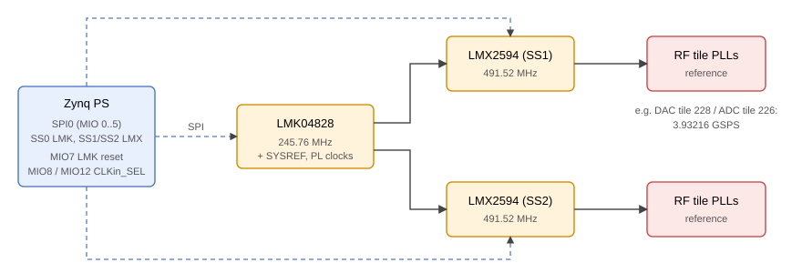
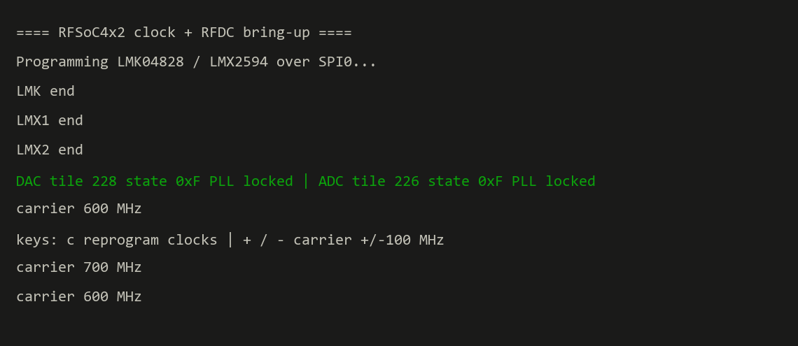

_+_Linux_driver-9A90FD.svg)  

[English](#en) | [中文](#cn)

　

<span id="en">RFSoC 4x2 Clock Configuration (LMK04828 + LMX2594)</span>
===========================

Configures the RFSoC 4x2 clock chips, **LMK04828** and two **LMX2594**, over **SPI**, in bare metal and under Linux, so the board can be used without PYNQ. The LMK04828 runs at 245.76 MHz and the LMX2594s give the RF data converters a 491.52 MHz reference.

　

|  |
| :----------------------------------: |
| **Figure1** : clock chips on PS SPI0 |

　

> **Note**  
> Use the official register values rather than generating your own in **TICS Pro**; even small configuration differences can cause unexpected errors. The values here match the PYNQ RFSoC4x2 files `LMK04828_245.76.txt` and `LMX2594_491.52.txt` ([RFSoC-PYNQ register_txts](https://github.com/Xilinx/RFSoC-PYNQ/tree/master/boards/RFSoC4x2/packages/tics/tics/register_txts)).

　

## Bare Metal: Clocks Only (Vitis 2025.1)

`hardware/design_1.tcl` + `vitis/sourceFile/`.

1. Vivado 2025.1: `source ./hardware/design_1.tcl`, generate the bitstream, export the hardware.
2. Vitis 2025.1: create a platform component from `vitis/hw_description` (or your own export), create an application component, import `vitis/sourceFile`, build and run.

　

## Bare Metal: Clocks + RF Data Converter (Vitis 2020.2)

`baremetal_rfdc/` is another way to do it: the same SPI sequence, then the RF data converter is brought up in the same program, and everything is built and loaded from scripts.

* **Clocks, then tiles**: `write_clk(0/1/2)` programs the LMK04828 and both LMX2594, then DAC tile 228 and ADC tile 226 are started on their own PLLs (3.93216 GSPS from 491.52 MHz); tile state and PLL lock are printed, the fine mixers are set to the carrier.
* **Classic and SDT Vitis flows**: the SPI / GPIO drivers are looked up by device ID (Vitis 2020.2 to 2023.1) or by base address (`SDT`, Vitis 2023.2 and later); `CLK_DEBUG` prints the SPI read-back of every register.
* **No GUI**: `hardware/make_project.tcl` (PS preset + RF data converter), `create_vitis.tcl` (platform + application), `run_jtag.tcl` (bitstream + ELF over JTAG).
* Used as the clock bring-up of the [RFSoC 4x2 OFDM video link](https://github.com/uceeyuf/rfsoc_ofdm/tree/main/boards/RFSoC4x2/ofdm_video).

```
cd baremetal_rfdc
vivado -mode batch -source hardware/make_project.tcl -tclargs build   # build/design_1_wrapper.xsa
xsct create_vitis.tcl                                                 # vitis_ws/clk_rfdc/Debug/clk_rfdc.elf
xsct run_jtag.tcl                                                     # UART1 115200: c = reprogram, +/- = carrier
```

|                         |
| :--------------------------------------------------------: |
| **Figure2** : `baremetal_rfdc` on the board (UART1)        |

If the tiles do not come up right after power-on, LMK PLL1 is still settling: press `c` (or rerun) until they report locked.

　

## Linux

Drivers and applications in `linux/` (cross-compilation required), see [linux/spi/README.md](linux/spi/README.md) and [linux/clk_APP/README.md](linux/clk_APP/README.md).

　

## Citation

If this work helps your research, please cite it:

```bibtex
@misc{rfsoc4x2_clock_lmk_lmx,
    author = {{Zzzed314} and Yijie Yu},
    title = {{RFSoC 4x2 Clock Configuration (LMK04828 + LMX2594)}},
    year = {2026},
    howpublished = {\url{https://github.com/uceeyuf/RFSoC4x2_clock_LMK_LMX}},
    note = {GitHub repository},
}
```

GitHub also offers the citation under **Cite this repository** (from [CITATION.cff](CITATION.cff)).

　

　

<span id="cn">RFSoC 4x2 时钟配置（LMK04828 + LMX2594）</span>
===========================

通过 **SPI** 配置 RFSoC 4x2 的时钟芯片 **LMK04828** 和两片 **LMX2594**，支持裸机和 Linux，板卡无需 PYNQ 即可使用。LMK04828 工作在 245.76 MHz，两片 LMX2594 为 RF 数据转换器提供 491.52 MHz 参考时钟。

　

|  |
| :----------------------------------: |
| **图1** : PS SPI0 上的时钟芯片        |

　

> **注意**  
> 请使用官方寄存器值，不要自己用 **TICS Pro** 生成；配置上的细小差异都可能导致意外错误。这里的值与 PYNQ RFSoC4x2 的 `LMK04828_245.76.txt`、`LMX2594_491.52.txt` 一致（[RFSoC-PYNQ register_txts](https://github.com/Xilinx/RFSoC-PYNQ/tree/master/boards/RFSoC4x2/packages/tics/tics/register_txts)）。

　

## 裸机：只配时钟（Vitis 2025.1）

`hardware/design_1.tcl` + `vitis/sourceFile/`。

1. Vivado 2025.1：`source ./hardware/design_1.tcl`，生成 bitstream，导出硬件。
2. Vitis 2025.1：用 `vitis/hw_description`（或自己导出的硬件）创建 platform component，新建 application component，导入 `vitis/sourceFile`，编译运行。

　

## 裸机：时钟 + RF 数据转换器（Vitis 2020.2）

`baremetal_rfdc/` 是另一种做法：同样的 SPI 配置流程，之后在同一个程序里启动 RF 数据转换器，全部用脚本编译和下载。

* **先时钟，后 tile**：`write_clk(0/1/2)` 配置 LMK04828 和两片 LMX2594，然后用各自 PLL 启动 DAC tile 228 和 ADC tile 226（491.52 MHz 参考，3.93216 GSPS），打印 tile 状态和 PLL 锁定，并把 fine mixer 设到载波频率。
* **兼容两种 Vitis 流程**：SPI / GPIO 驱动在 Vitis 2020.2 到 2023.1 按设备 ID 查找，在 Vitis 2023.2 及以后（`SDT`）按基地址查找；定义 `CLK_DEBUG` 可打印每个寄存器的 SPI 回读值。
* **不用 GUI**：`hardware/make_project.tcl`（PS preset + RF 数据转换器），`create_vitis.tcl`（platform + 应用），`run_jtag.tcl`（JTAG 下载 bitstream 和 ELF）。
* 已作为 [RFSoC 4x2 OFDM 视频链路](https://github.com/uceeyuf/rfsoc_ofdm/tree/main/boards/RFSoC4x2/ofdm_video) 的时钟启动部分使用。

```
cd baremetal_rfdc
vivado -mode batch -source hardware/make_project.tcl -tclargs build   # build/design_1_wrapper.xsa
xsct create_vitis.tcl                                                 # vitis_ws/clk_rfdc/Debug/clk_rfdc.elf
xsct run_jtag.tcl                                                     # UART1 115200：c 重配时钟，+/- 调载波
```

|              |
| :---------------------------------------------: |
| **图2** : `baremetal_rfdc` 上板运行（UART1）    |

上电后如果 tile 没有起来，是 LMK PLL1 还在稳定：按 `c`（或重新运行）直到显示 locked。

　

## Linux

驱动和应用在 `linux/` 目录（需要交叉编译），见 [linux/spi/README.md](linux/spi/README.md) 与 [linux/clk_APP/README.md](linux/clk_APP/README.md)。

　

## 引用

如果这个项目对你的研究有帮助，请引用：

```bibtex
@misc{rfsoc4x2_clock_lmk_lmx,
    author = {{Zzzed314} and Yijie Yu},
    title = {{RFSoC 4x2 Clock Configuration (LMK04828 + LMX2594)}},
    year = {2026},
    howpublished = {\url{https://github.com/uceeyuf/RFSoC4x2_clock_LMK_LMX}},
    note = {GitHub repository},
}
```

GitHub 仓库页的 **Cite this repository** 也提供同样的引用（来自 [CITATION.cff](CITATION.cff)）。
